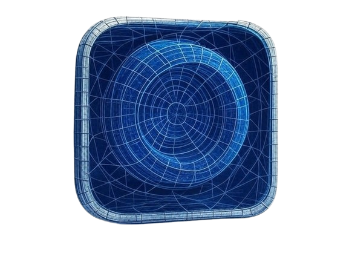
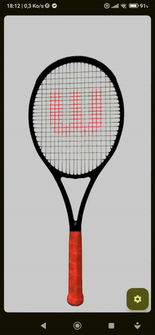

  

# Model3DViewer

**Model3DViewer** is a mobile Android application that demonstrates how to render and manipulate **3D models** using a **WebView** embedded in a **Jetpack Compose** interface.

This is a **Proof of Concept (POC)** that combines native Android capabilities with web-based 3D rendering powered by **three.js**.

---

## 🚀 Project Overview

**Context**:  
Integrating immersive 3D visualizations in modern Android apps can enhance user interaction and design. This project shows how to embed and control 3D content using `three.js` inside a native Jetpack Compose app.

**Objectives**:  
- Render 3D models in an Android WebView.
- Enable interaction via touch gestures and sensors.
- Implement reusable Compose screens for various use cases.
- Showcase a bridge between Kotlin and JavaScript.
- Ensure offline rendering by bundling all 3D scripts locally.

---

## ⚙️ Main Features

- Render **3D models** (STL, GLTF, GLB) with **three.js** inside a WebView.
- Use **OrbitControls** for touch-based interaction (rotate, zoom).
- Load custom 3D files from **device storage**.
- Display the 3D model **above the UI** with a transparent WebView.
- Rotate the model using **device sensors** (gyroscope, accelerometer, magnetometer).
- Configure lighting and camera through a dynamic bottom sheet.
- Full support for **offline mode** (no network required).

---

## 📈 Development Tasks

| Step | Goal | Outcome |
| :--- | :--- | :--- |
| **Project Setup** | Compose + WebView integration | Jetpack Compose linked with embedded WebView |
| **three.js Integration** | Render 3D content | Scene loaded using local JS files |
| **Model Interaction** | OrbitControls + File picker | Custom 3D models loadable from gallery |
| **Sensor Control** | Real-world rotation support | Model reacts to device orientation |
| **Bridge Implementation** | Communication Kotlin ⇄ JS | Custom commands via `evaluateJavascript()` |
| **Polish & Documentation** | Clean code + visual assets | Screenshots and full README written |

---

## 🛠️ Tech Stack

- **Language**: Kotlin
- **UI**: Jetpack Compose
- **Architecture**: MVVM (loosely)
- **3D Rendering**: [three.js](https://threejs.org/)
- **Web Integration**: Android WebView
- **3D File Support**: STL, GLTF, GLB
- **Sensor Fusion**: Gyroscope, Accelerometer, Magnetometer
- **Testing**: Manual & Visual (POC stage)
- **IDE**: Android Studio Giraffe

---

## 📸 Screenshots

| Girl 3d model | Racquet 3d model | Sumo 3d model | 
|:---:|:---:|:---:|
|  |  |  | 

| Scene 3d model | Burger 3d model | Loader | 
|:---:|:---:|:---:|
|  |  |  | 

---

## 🧩 Integration of three.js & Module Handling

During development, one of the main challenges was using **three.js modules** in a WebView context. Since **WebViews in Android do not support ES6 module syntax (e.g., `import { OrbitControls } from 'three/examples/jsm/...')**, we had to find an alternative approach.

### 🛠 Solutions Implemented

- All necessary three.js scripts (including `three.min.js`, `OrbitControls.js`, `GLTFLoader.js`, etc.) were **manually downloaded and bundled** inside the `/assets` folder of the Android app.
- Instead of using `import` statements, we switched to **global script loading via `<script>` tags**, maintaining compatibility with the WebView runtime.
- 3D model loading, scene creation, and interaction logic were written inside a local `index.html` file, using global references to three.js components.

### 📦 Advantages

- Full **offline support**, no CDN or internet required.
- Avoids CORS or MIME-type issues when loading modules locally.
- Works seamlessly across all Android versions supporting WebView.

### ⚠️ Known Limitations

- Can’t use modern ES Modules (`import`) or NPM-based three.js structure (Android JS file locker, so i use the oldi 0.125.0 build).
- Debugging JavaScript inside WebView can be limited compared to browser tools.
- Need to keep scripts updated manually if three.js releases new features or fixes.

This approach ensures **maximum compatibility** while preserving the power of three.js in a constrained Android WebView environment.

---

## 🎯 Final Result

✅ Embedded 3D models directly in a Jetpack Compose UI.  
✅ Works entirely offline with locally bundled JS.  
✅ Advanced interaction via touch and sensors.  
✅ Modular, reusable Composable screens for 3D rendering.  
✅ Complete separation between native and Web logic through a communication bridge.

---

---
